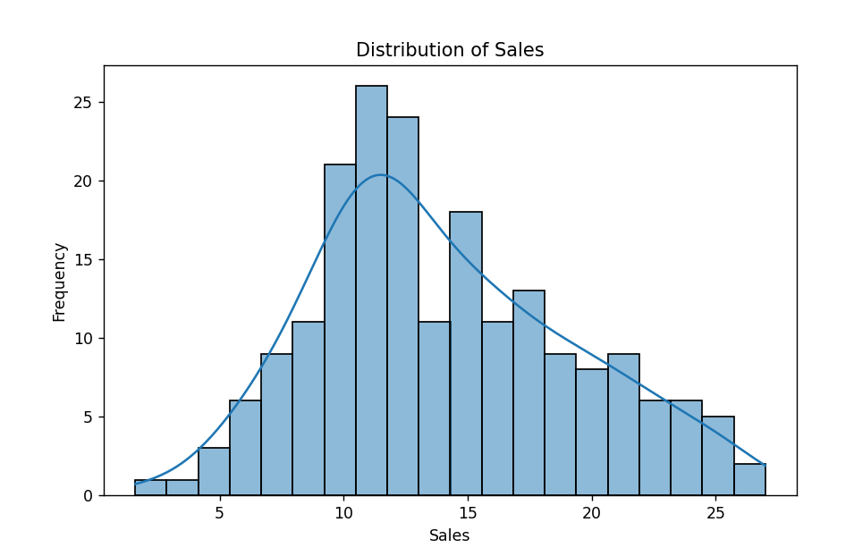
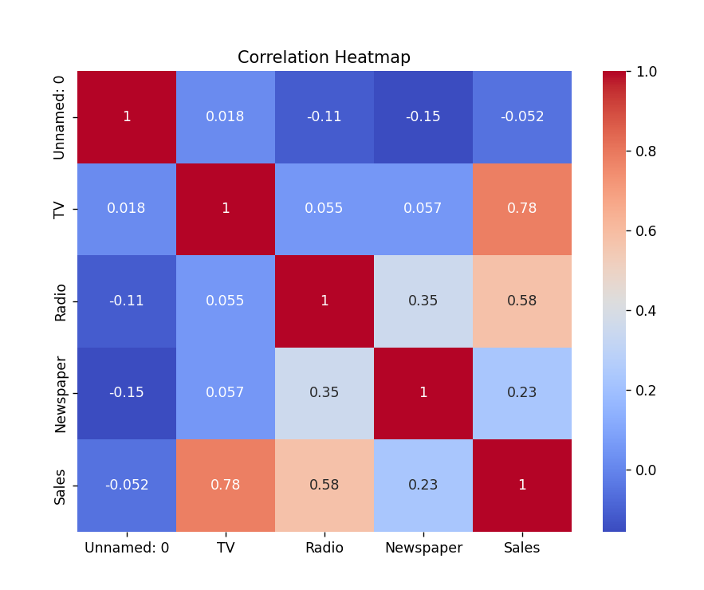
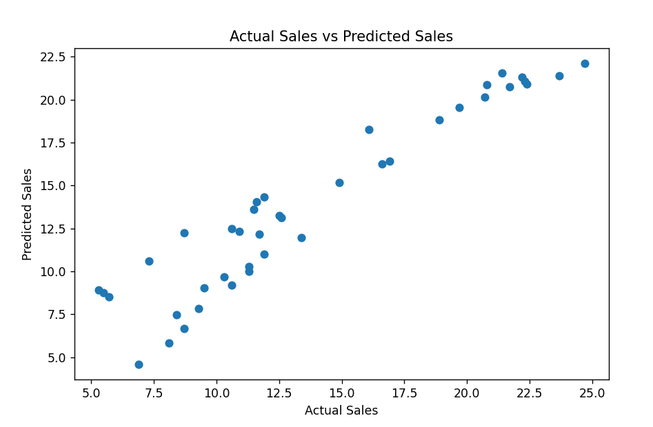

# Sales Prediction using Machine Learning

## Project Overview

This project predicts product sales based on advertising expenditure on TV, Radio, and Newspaper platforms using Linear Regression.

## Technologies Used

- Python
- Pandas
- NumPy
- Matplotlib
- Seaborn
- Scikit-learn

## Dataset Features

- TV Advertising Budget
- Radio Advertising Budget
- Newspaper Advertising Budget

Target:
- Sales

## Machine Learning Algorithm

Linear Regression

## Project Workflow

1. Data Loading
2. Data Cleaning
3. Exploratory Data Analysis
4. Data Visualization
5. Feature Selection
6. Train-Test Split
7. Model Training
8. Sales Prediction
9. Model Evaluation

## Evaluation Metrics

- Mean Absolute Error (MAE)
- Mean Squared Error (MSE)
- R² Score

## Business Insights

- TV advertising has the strongest impact on sales.
- Radio advertising positively influences sales.
- Newspaper advertising contributes less compared to TV and Radio.
- Increasing advertising budgets generally increases sales.

## Output Screenshots

### Sales Distribution

### Correlation Heatmap

### Actual vs Predicted Sales

## Author

Developed as part of CodeAlpha Data Science Internship.
